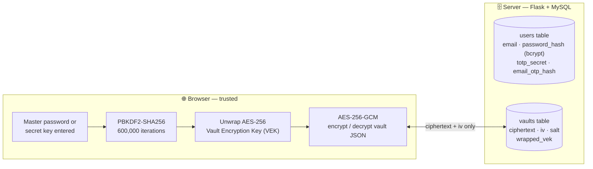
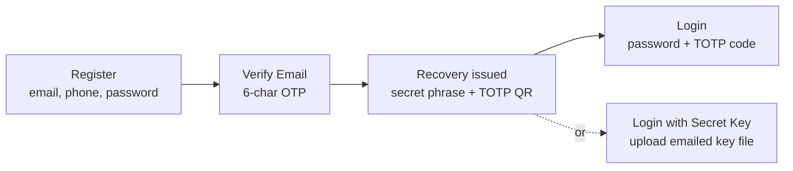
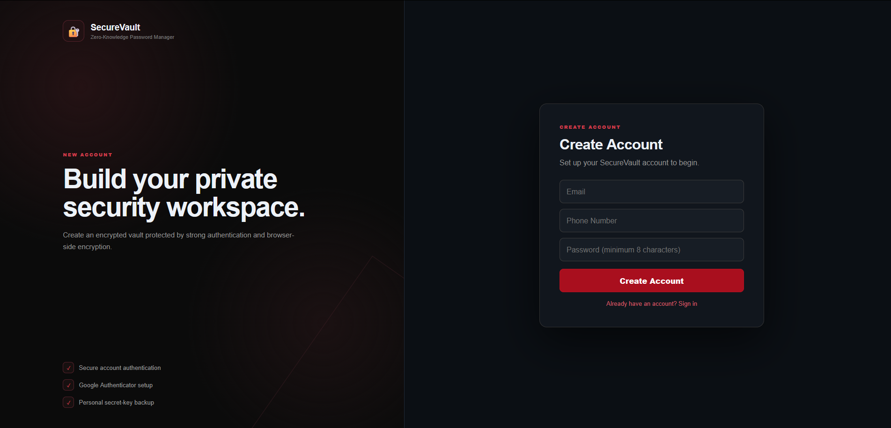
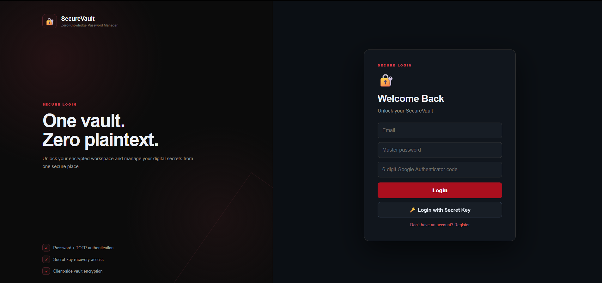
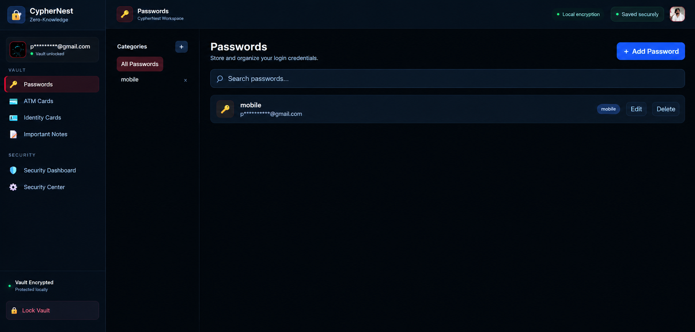
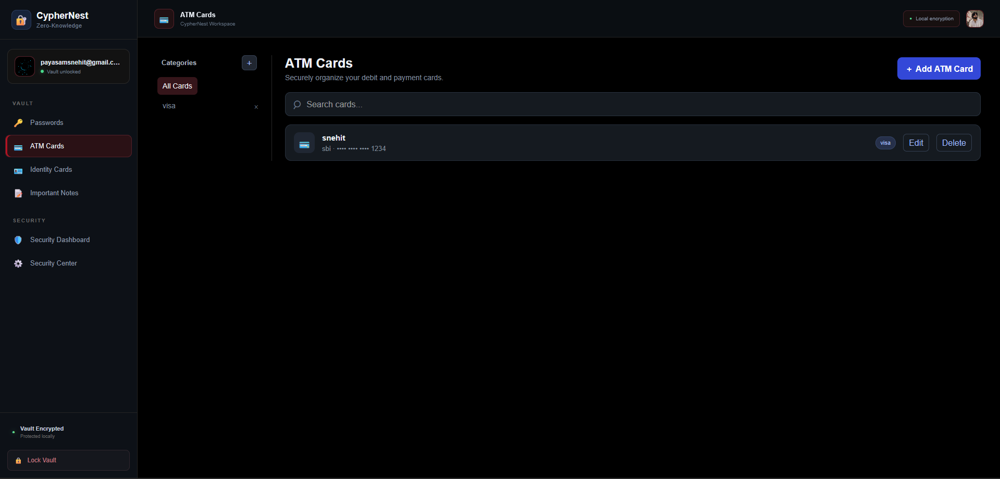
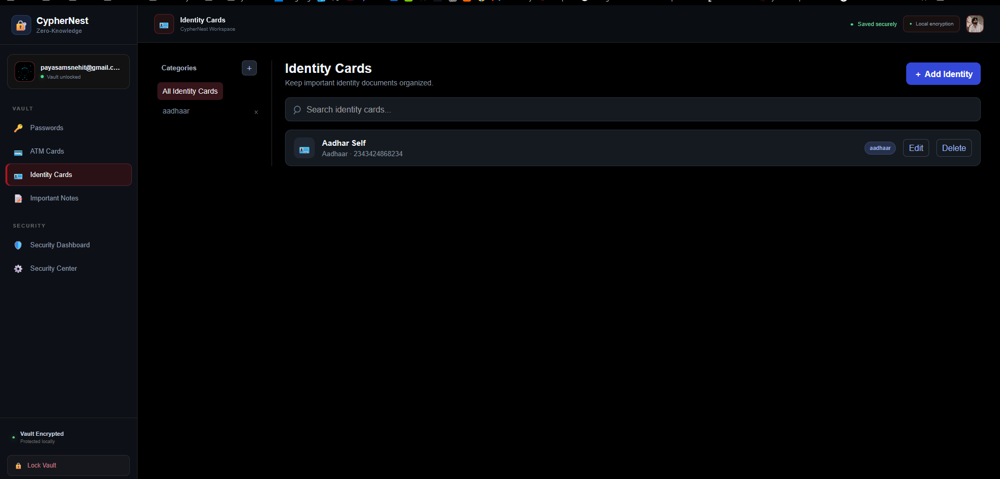
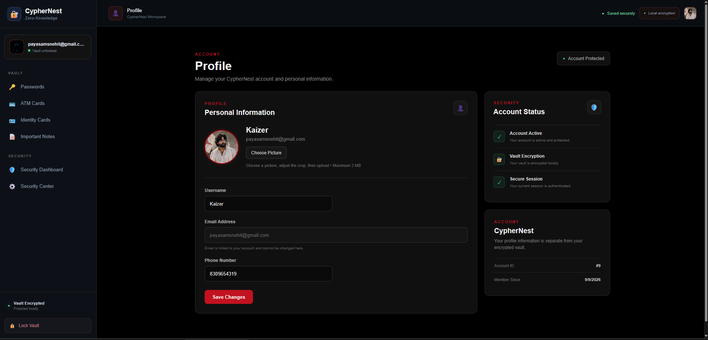

# 🔐 CypherNest

**A zero-knowledge password manager — the server stores ciphertext, never secrets.**

CypherNest encrypts every vault item (passwords, cards, IDs, notes) inside the browser before it ever reaches the backend. The Flask + MySQL server only ever sees encrypted bytes, password hashes, and TOTP secrets — never a plaintext password, never a vault key, never vault contents.


---

## Table of Contents

- [Overview](#overview)
- [Features](#features)
- [Architecture](#architecture)
- [Encryption Design](#encryption-design)
- [Tech Stack](#tech-stack)
- [Project Structure](#project-structure)
- [Getting Started](#getting-started)
  - [Prerequisites](#prerequisites)
  - [Database Setup](#database-setup)
  - [Backend Setup](#backend-setup)
  - [Frontend Setup](#frontend-setup)
- [Environment Variables](#environment-variables)
- [API Reference](#api-reference)
- [Screenshots](#screenshots)
- [Security Notes](#security-notes)
- [Roadmap](#roadmap)
- [License](#license)

---

## Overview

Most password managers ask you to trust them with your keys as well as your data. CypherNest is built around a simpler promise: **if it isn't encrypted in the browser first, it doesn't leave the browser.**

- Vault contents are encrypted client-side with **AES-256-GCM** before any network request.
- The encryption key itself is never sent to the server — it's wrapped (encrypted) with a key derived from your **master password** *and separately* with a key derived from a one-time **secret recovery phrase**, so either one can unlock your vault independently.
- The backend authenticates you (bcrypt-hashed password + TOTP 2FA) and stores the encrypted blob — it has no way to read it.

## Features

- 🔑 **Passwords** — categorized credential storage with per-entry decryption
- 💳 **ATM / Debit Cards** — masked card numbers, network tags, custom categories
- 🪪 **Identity Cards** — Aadhaar and other ID documents, encrypted alongside everything else
- 📝 **Important Notes** — free-form secure notes in the same vault
- 📊 **Security Dashboard** — password strength scoring (Weak / Medium / Strong), reused-password detection, built-in generator (length + character-set toggles)
- 🛡️ **Security Center** — at-a-glance status for vault encryption, local decryption, TOTP, email verification, and secret-key recovery
- 👤 **Profile management** — username, phone, avatar upload (≤ 2 MB), kept separate from the encrypted vault
- 🔐 **Two independent login paths** — master password + TOTP, or a one-time secret-key file

## Architecture



The server can store the encrypted blob, back it up, move it around — and still never read it.

### Authentication & recovery flow



## Encryption Design

Every vault has one **Vault Encryption Key (VEK)** — a random AES-256 key generated client-side. It's wrapped twice so either credential can unlock it independently:

| Path | Derivation | Wrap |
|---|---|---|
| Master password | PBKDF2-SHA256, 600,000 iterations, random salt | AES-GCM |
| Secret recovery phrase (6 words) | PBKDF2-SHA256, 600,000 iterations, random salt | AES-GCM |

The wrapped result is stored server-side as a single JSON bundle:

```json
{
  "version": 1,
  "algorithm": "AES-GCM-256",
  "kdf": "PBKDF2-SHA256",
  "password":  { "salt": "...", "iv": "...", "data": "..." },
  "secretKey": { "salt": "...", "iv": "...", "data": "..." }
}
```

All of this lives in [`crypto.js`](./CypherNest/SecVault_Rjsx/securevault-frontend/src/crypto.js) and runs entirely in the browser via the **Web Crypto API** (`SubtleCrypto`) — the server never receives a password, a derived key, or the VEK itself.

## Tech Stack

| Layer | Technology |
|---|---|
| Frontend | React 18 + Vite, axios, react-easy-crop (avatar cropping), qrcode.react (TOTP QR) |
| Client-side crypto | Web Crypto API — PBKDF2-SHA256, AES-256-GCM |
| Backend | Flask, Flask-CORS, session-based auth |
| Database | MySQL (`mysql-connector-python`) |
| Auth & security | bcrypt (password hashing), PyOTP (TOTP), qrcode + Pillow (QR & avatar handling) |
| Email | SMTP — OTP delivery, secret-key file delivery, TOTP QR provisioning |

## Project Structure

```
CypherNest/
├── app.py                      # Flask API — auth, vault, profile routes
├── otp.py                      # Email OTP generator
├── phrase.py                   # 6-word recovery phrase generator
├── requirements.txt
└── SecVault_Rjsx/
    └── securevault-frontend/
        ├── package.json
        └── src/
            ├── api.js          # axios client
            ├── crypto.js       # PBKDF2 / AES-GCM / VEK wrapping
            ├── App.jsx
            ├── main.jsx
            ├── register/Register.jsx
            ├── verify-email/VerifyEmail.jsx
            ├── login/Login.jsx
            ├── login-key/LoginKey.jsx
            └── home/
                ├── Home.jsx
                ├── Sidebar.jsx
                ├── VaultView.jsx
                ├── Passwords.jsx        + PasswordEditor.jsx
                ├── AtmCards.jsx         + AtmCardEditor.jsx
                ├── IdentityCards.jsx    + IdentityEditor.jsx
                ├── Notes.jsx
                ├── Profile.jsx
                ├── SecurityDashboard.jsx
                └── SecurityCenter.jsx
```

## Getting Started

### Prerequisites

- Python 3.11+
- Node.js 18+ and npm
- MySQL Server 8+
- A Gmail account with an [app password](https://myaccount.google.com/apppasswords) for sending OTP / recovery emails (or swap in your own SMTP provider)

### Database Setup

Create a database and the two tables the backend expects:

```sql
CREATE DATABASE securevault;
USE securevault;

CREATE TABLE users (
    id                     INT AUTO_INCREMENT PRIMARY KEY,
    email                  VARCHAR(255) NOT NULL UNIQUE,
    phone                  VARCHAR(20),
    username               VARCHAR(100) UNIQUE,
    password_hash          VARCHAR(255) NOT NULL,
    totp_secret            VARCHAR(64) NOT NULL,
    totp_enabled           BOOLEAN DEFAULT FALSE,
    email_otp_hash         VARCHAR(255),
    email_verified         BOOLEAN DEFAULT FALSE,
    phrase_hash            VARCHAR(255),
    profile_picture        LONGBLOB,
    profile_picture_type   VARCHAR(50),
    created_at             TIMESTAMP DEFAULT CURRENT_TIMESTAMP
);

CREATE TABLE vaults (
    id            INT AUTO_INCREMENT PRIMARY KEY,
    user_id       INT NOT NULL UNIQUE,
    ciphertext    LONGTEXT NOT NULL,
    iv            VARCHAR(255) NOT NULL,
    salt          VARCHAR(255),
    wrapped_vek   TEXT NOT NULL,
    FOREIGN KEY (user_id) REFERENCES users(id) ON DELETE CASCADE
);
```

### Backend Setup

```bash
cd CypherNest
python -m venv venv
source venv/bin/activate        # Windows: venv\Scripts\activate

pip install -r requirements.txt
```

Set the environment variables listed [below](#environment-variables), then run:

```bash
python app.py
```

The API starts on `http://127.0.0.1:5000`.

### Frontend Setup

```bash
cd CypherNest/SecVault_Rjsx/securevault-frontend
npm install
npm run dev
```

The app starts on `http://127.0.0.1:5173` and expects the Flask API at `http://127.0.0.1:5000`.

## Environment Variables

The current `app.py` has database credentials, the Flask session secret, and the email app password **hardcoded**. Before running this yourself (and definitely before pushing to a public repo), pull them out into environment variables:

```bash
# .env (do not commit this file — add it to .gitignore)
FLASK_SECRET_KEY=replace-with-a-long-random-value
DB_HOST=127.0.0.1
DB_USER=root
DB_PASSWORD=your-mysql-password
DB_NAME=securevault
EMAIL_ADDRESS=your-sender@gmail.com
EMAIL_APP_PASSWORD=your-gmail-app-password
```

```python
import os
app.secret_key = os.environ["FLASK_SECRET_KEY"]

def get_db():
    return mysql.connector.connect(
        host=os.environ["DB_HOST"],
        user=os.environ["DB_USER"],
        password=os.environ["DB_PASSWORD"],
        database=os.environ["DB_NAME"],
    )
```

(Load them with `python-dotenv`, or export them in your shell / deployment environment.)

## API Reference

All endpoints are served from `app.py`. Vault and profile routes require an authenticated session (`/login` or `/login-key` first).

| Method | Endpoint | Description | Auth required |
|---|---|---|---|
| GET | `/` | Health check | No |
| POST | `/register` | Create account, email an OTP | No |
| POST | `/verify-email` | Verify OTP; issues recovery phrase + TOTP QR | No |
| POST | `/login` | Login with password + TOTP code | No |
| POST | `/login-key` | Login with the emailed secret-key file | No |
| GET | `/vault` | Fetch the encrypted vault blob | Yes |
| POST | `/vault` | Create the encrypted vault (first save) | Yes |
| PUT | `/vault` | Update the encrypted vault | Yes |
| DELETE | `/vault` | Delete the vault | Yes |
| POST | `/logout` | Clear the session | Yes |
| GET | `/profile` | Fetch profile info | Yes |
| PUT | `/profile` | Update username / phone | Yes |
| POST | `/profile-picture` | Upload avatar (≤ 2 MB, JPG/PNG/WEBP) | Yes |

## Screenshots

| Create Account | Welcome Back |
|---|---|
|  |  |

| Passwords | ATM Cards |
|---|---|
|  |  |

| Identity Cards | Profile |
|---|---|
|  |  |

## Security Notes

- **Move hardcoded secrets to environment variables** — see [Environment Variables](#environment-variables). The database password, Flask session secret, and email app password in `app.py` should never be committed to source control. If this repo (or an earlier version of it) has already been pushed with real credentials, rotate them.
- **Add a `.gitignore`** covering at least: `venv/`, `secva/`, `__pycache__/`, `*.pyc`, `.env`, `node_modules/`, and `google_authenticator.png` (a generated per-run artifact, not something to ship).
- **Legacy naming** — some backend strings (email subject lines, the TOTP `issuer_name`, the `securevaultopenbeta0@gmail.com` sender, the `secva` venv folder) still reference the project's earlier name, *SecureVault*. Update these for consistent CypherNest branding if you'd like the emails and authenticator app entry to match the UI.
- Flask's built-in session cookie is used for auth state; in production, serve over HTTPS and set `SESSION_COOKIE_SECURE=True` and `SESSION_COOKIE_HTTPONLY=True`.
- Consider rate-limiting `/login`, `/login-key`, and `/verify-email` to slow down brute-force attempts against the bcrypt/TOTP checks.
- `debug=True` in `app.run()` should be turned off outside local development.

## Roadmap

- 🧩 Browser extension for inline autofill and capture
- 🤝 Encrypted vault-item sharing between trusted users
- 🔑 WebAuthn / FIDO2 hardware security key support
- 📈 Audit logging and anomaly alerts on vault access

## License

No license has been added yet. Until one is added, all rights are reserved by default — add a `LICENSE` file (e.g. MIT, Apache-2.0) if you want others to use, modify, or contribute to this project.
